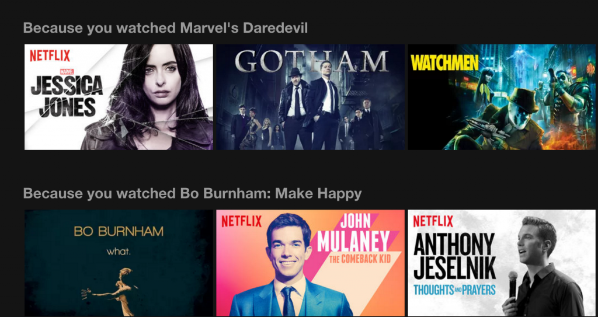

## Building a MovieLens Recommender System

### TMLS 2020 Workshop 

Want to know how Spotify, Amazon, and Netflix generate recommendations for their users? In this introductory workshop, we'll learn how to build collaborative filtering and content-based filtering recommender systems using the [MovieLens](https://grouplens.org/datasets/movielens/) dataset.  

We'll be using these packages to do our analysis:

- [pandas](https://pandas.pydata.org/)
- [numpy](https://numpy.org/)
- [matplotlib](https://matplotlib.org/)
- [seaborn](https://seaborn.pydata.org/)
- [scikit-learn](https://scikit-learn.org/stable/)
- [fuzzywuzzy](https://pypi.org/project/fuzzywuzzy/)

In this repo, you'll find two notebooks:

1. [tutorial](tutorial.ipynb): the original notebook with solutions 
2. [tutorial_walkthrough](tutorial_walkthrough.ipynb): fill-in-the-blank notebook (use this one to follow along during the live tutorial)

### Getting Started 

There are two options for setting up your environment:

1. On your local machine 
2. On the cloud using Google Colab (create a duplicate of [this notebook](https://colab.research.google.com/drive/1UykHTqqHvJ075cX7oT086hNGOq0BBVhp?usp=sharing))

If you're relatively new to Python and programming, we highly recommend starting with the cloud option which doesn't require any setup. The only requirement is a Gmail account. 

If you decide to run the tutorial on your local machine, make sure that your environment is running on Python 3.6+ and has Jupyter notebook installed. 